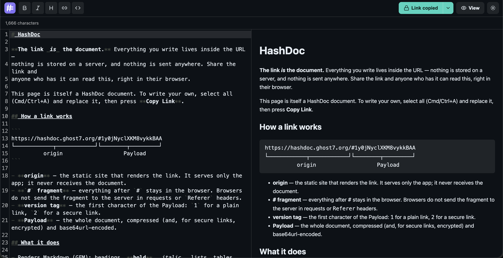
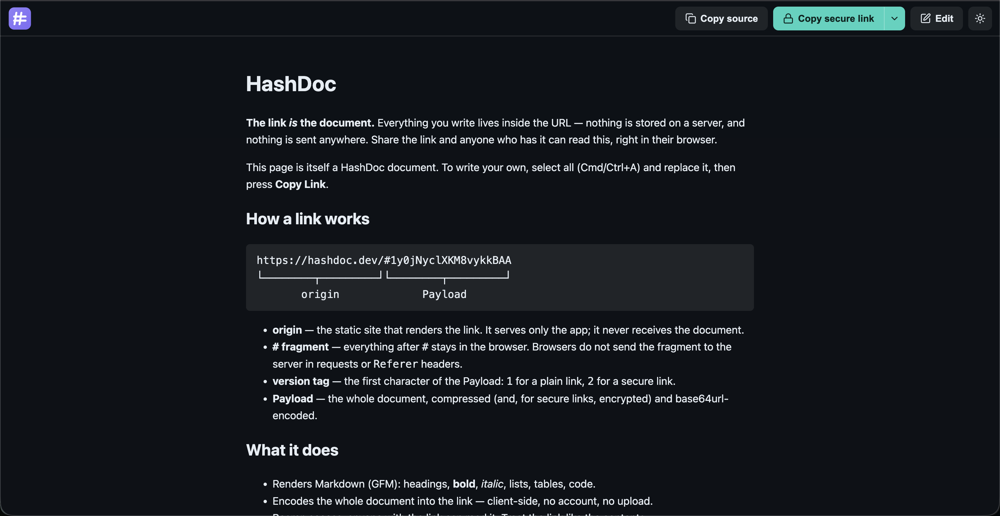

# HashDoc

HashDoc turns markdown into a single shareable Link.

A Link looks like this:

```
https://hashdoc.dev/#1y0jNyclXKM8vykkBAA
└────────────┬────────────┘└────────┬─────────┘
          origin                   Payload
```

- **origin** — the static site that renders the Link. It serves only the app; it
  never receives the Document.
- **`#` fragment** — everything after `#` stays in the browser. Browsers do not
  send the fragment to the origin server in requests or `Referer` headers.
- **version tag** — the first character of the Payload: `1` for a plain Link,
  `2` for a [secure Link](#secure-links).
- **Payload** — the whole Document, compressed (and, for secure Links, encrypted)
  and base64url-encoded.

Paste markdown into the Editor, copy the Link, and send it to someone. Opening
that Link reconstructs and renders the Document entirely in the browser. The
Document is compressed into the URL fragment, so no server receives or stores
the content. There is nothing to install, no account, and no tracking.





Agents can also create Links directly through the HashDoc MCP server.

## What Is HashDoc?

HashDoc is a client-side-only web app for sharing markdown as a Link:

- **People** create Links by pasting markdown into the Editor and copying the result.
- **Agents** create Links through the MCP server.
- **Recipients** open the Link, read the rendered Document, and can fork-and-edit it into a new Link.

Because the Document lives in the URL fragment, browsers do not send it to the  
origin server in requests or `Referer` headers. Links are still bearer-access:  
anyone with the Link can read the Document.

## Getting Started Online

Open [hashdoc.dev](https://hashdoc.dev/).

To create a Link:

1. Paste or write markdown in the Editor.
2. Preview the rendered Document.
3. Click **Copy Link**.
4. Share the copied Link.

To read a Link, open it in a browser. To edit what you received, use the Editor
to create a new Link. Editing never mutates the Link you opened.

## Secure Links

A plain Link is bearer-access: anyone who has it can read the Document. When that
is not enough, HashDoc can produce a **secure Link** that is encrypted with a
password.

In the Editor, open the **Copy Link** menu and choose **Copy secure link**. You
set a password, and the Document is encrypted in your browser before it is placed
in the Link. Opening a secure Link prompts the reader for the password and only
renders the Document once the correct password is entered.

To create a secure Link:

1. Write your markdown in the Editor.
2. Open the **Copy Link** split-button menu and choose **Copy secure link**.
3. Enter a password and copy the resulting `…/#2…` Link.
4. Share the Link and the password through **separate** channels.

Key properties:

- **Client-side encryption.** Encryption happens entirely in the browser using
  the native Web Crypto API — no server, no upload, no extra dependencies.
- **AES-256-GCM** with a key derived from the password via **PBKDF2-HMAC-SHA-256
  (600,000 iterations)**. A random salt and IV are generated per Link.
- **The password is never stored in the Link.** Only the non-secret salt, IV, and
  iteration count travel inside the Payload. Share the password separately — never
  in the same message as the Link.
- **No recovery.** If the password is lost, the Document is unrecoverable. A wrong
  password fails the integrity check and surfaces as an incorrect-password error.

Secure Links use the `2` version tag and otherwise behave like plain Links: the
encrypted Document still lives entirely in the URL fragment. The format is frozen
and documented in [FORMAT.md](packages/core/FORMAT.md).

## Using The MCP Server

The published MCP package lets agents create and read HashDoc Links without
running this repository locally.

Example MCP client configuration:

```json
{
  "mcpServers": {
    "HashDoc": {
      "command": "npx",
      "args": ["-y", "@hashdoc/mcp"],
      "env": {
        "HASHDOC_BASE_URL": "https://hashdoc.dev/"
      }
    }
  }
}
```

`HASHDOC_BASE_URL` controls the origin used for generated Links. If unset,
it defaults to `https://hashdoc.dev/`.

The server speaks stdio, makes zero network calls, and exposes two tools:

| Tool                   | Input                               | Result                          |
| ---------------------- | ----------------------------------- | ------------------------------- |
| `create_markdown_link` | `{ markdown }`                      | `{ url, characters, warning? }` |
| `read_markdown_link`   | `{ url }` full Link or bare Payload | `{ markdown }`                  |

There is no update tool. Editing is another create operation that produces a
new Link.

## Running HashDoc Locally

This is a pnpm and TypeScript monorepo with three packages:

| Package                          | What it is                                                                                                                                                                   |
| -------------------------------- | ---------------------------------------------------------------------------------------------------------------------------------------------------------------------------- |
| `[packages/core](packages/core)` | The Link format: `encode`/`decode`, version-tag handling, and link/size helpers. Shared by `web` and `mcp`. The v1 format is frozen in [FORMAT.md](packages/core/FORMAT.md). |
| `[packages/web](packages/web)`   | The Viewer, Editor, and shared render module built with Vite, Preact, and CodeMirror.                                                                                        |
| `[packages/mcp](packages/mcp)`   | The MCP server exposing HashDoc tools over stdio.                                                                                                                            |

Prerequisites:

- Node.js >= 20
- pnpm 10 via Corepack

Install dependencies:

```bash
corepack enable
pnpm install
```

Run the web app with live reload:

```bash
pnpm dev
```

This starts the Vite dev server for `@hashdoc/web` at
`http://localhost:5173`.

Build, test, and type-check all packages:

```bash
pnpm build      # build all packages
pnpm test       # run all tests
pnpm typecheck  # type-check all packages
```

`web` type-checks against `core`'s built output, so run `pnpm build` before a
cold `pnpm typecheck`.

Build and preview the static website:

```bash
pnpm --filter @hashdoc/web build      # outputs packages/web/dist
pnpm --filter @hashdoc/web preview     # serves the built dist locally
```

The build is fully static and origin-relative (`base: './'`), so
`packages/web/dist` can be dropped onto any static host. Everything is bundled
and self-hosted, including fonts, highlight.js, Mermaid, and KaTeX.

### Security headers

The page ships a strict Content-Security-Policy via a `<meta>` tag, but a few
protections (notably `frame-ancestors` for clickjacking) only work as real HTTP
response headers. The build emits a `dist/_headers` file that hosts like
Cloudflare Pages and Netlify apply automatically. On other hosts (nginx, Caddy,
Coolify static), configure these response headers yourself:

```
Content-Security-Policy: frame-ancestors 'none'
X-Frame-Options: DENY
X-Content-Type-Options: nosniff
Referrer-Policy: no-referrer
Cross-Origin-Opener-Policy: same-origin
Permissions-Policy: camera=(), microphone=(), geolocation=(), browsing-topics=()
Strict-Transport-Security: max-age=63072000
```

`pnpm --filter @hashdoc/web preview` serves these headers locally so the
production configuration can be verified.

Build and run the local MCP server:

```bash
pnpm --filter @hashdoc/mcp build
HASHDOC_BASE_URL="http://localhost:5173/" node packages/mcp/dist/bin.js
```

Or point an MCP client at the local build:

```json
{
  "mcpServers": {
    "HashDoc": {
      "command": "node",
      "args": ["/absolute/path/to/HashDoc/packages/mcp/dist/bin.js"],
      "env": {
        "HASHDOC_BASE_URL": "https://hashdoc.dev/"
      }
    }
  }
}
```

## Contributing

Keep changes aligned with the core product promise: the Link is the Document.
The app should remain client-side only, with no accounts, uploads, analytics, or
third-party runtime requests.

Useful references:

- [CONTEXT.md](CONTEXT.md) defines the project vocabulary.
- [packages/core/FORMAT.md](packages/core/FORMAT.md) documents the frozen v1 Link format.
- [docs/adr/0001-the-link-is-the-document.md](docs/adr/0001-the-link-is-the-document.md) explains why the Document lives in the URL fragment.
- [docs/adr/0002-no-third-party-requests.md](docs/adr/0002-no-third-party-requests.md) explains the zero third-party requests constraint.

Before opening a change, run:

```bash
pnpm build
pnpm test
pnpm typecheck
```
